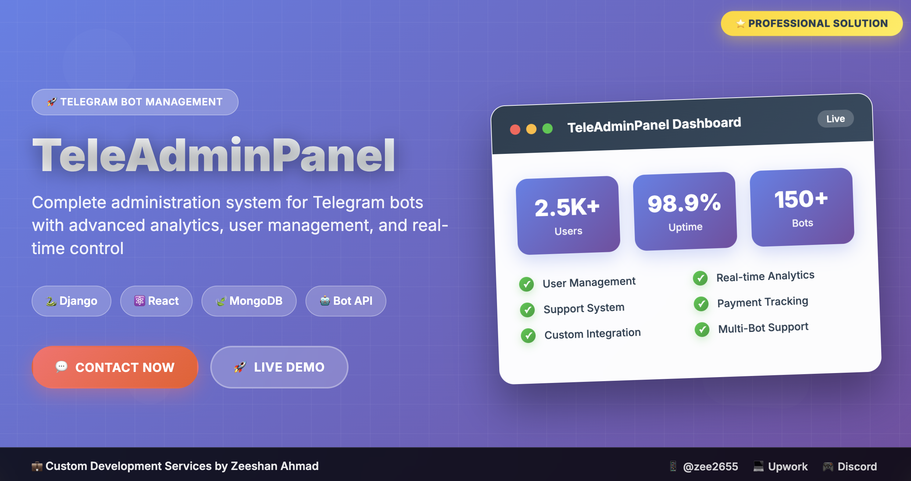

# TeleAdminPanel - Professional Telegram Bot Administration System

  
  
  

---

##  **Transform Your Telegram Bot Management Today!**

> **TeleAdminPanel is a comprehensive web-based administration system designed for seamless integration with Telegram bots. Originally crafted for TradingView signal bots, but fully customizable for any Telegram bot operation.**

##

###  **Why Bot Owners Choose TeleAdminPanel**
-  **Web-Based Access** - Manage from anywhere, any device
-  **Enterprise Security** - Secure authentication & user management
-  **Real-Time Integration** - Instant bot synchronization
-  **Advanced Analytics** - Deep insights into bot performance
-  **Revenue Management** - Subscription & payment tracking
-  **Complete Control** - Every aspect of your bot, centralized

---

##  **Comprehensive Feature Set**

<table>
<tr>
<td width="50%">

###  **Core Management**
 **Web-Based Access** - Any device, anywhere  
 **Secure Authentication** - Enterprise-grade security  
 **Real-Time Integration** - Instant bot synchronization  
 **User Verification** - Manual identity confirmation  
 **Advanced Analytics** - Deep behavioral insights  
 **Content Management** - Upload & organize media  

</td>
<td width="50%">

###  **Business Operations**
 **Subscription Management** - Monthly channel tracking  
 **Payment Oversight** - Content payment management  
 **Revenue Analytics** - Financial performance tracking  
 **Support Ticket System** - Professional customer service  
 **Agent Management** - Add/remove support staff  
 **Bulk Messaging** - Broadcast with media support  

</td>
</tr>
</table>

###  **Advanced Administrative Tools**

####  User Management Suite
-  View Users - Comprehensive user list with filters
-  Verify Users - Manual identity verification system
-  Increment Count - Add remaining usage credits
-  Decrement Count - Remove usage credits  
-  Set Count - Define specific remaining counts
-  User Analytics - Individual user behavior tracking

####  Support Agent Management
-  Add Support Agent - Register new support staff
-  Remove Agent - Deactivate support personnel  
-  Agent Dashboard - Track agent performance
-  Ticket Assignment - Distribute support requests

####  Communication Tools
-  Send Messages - Broadcast to all users
-  Media Support - Attach images and videos
-  Targeted Messaging - Send to specific user groups
-  Message Analytics - Track engagement rates

#### Database Management
-  Content Uploads - Manage all uploaded media
-  Remove Entries - Clean database records
-  Data Analytics - Database performance insights
-  Backup Management - Secure data protection

---

##  **Built with Industry-Leading Technologies**

###  **Technology Stack**

- React - Modern, responsive user interface
- Django - Robust Python web framework  
- MongoDB - Flexible NoSQL database
- Telegram Bot API - Real-time bot integration
- JWT Authentication - Secure access control
- Chart.js - Beautiful data visualizations

---

##  **Perfect For These Business Models**

###  **Who Benefits Most?**

<table>
<tr>
<td width="33%">

####  **Trading Signal Providers**
- Manage premium subscribers
- Track subscription renewals
- Send trading signals with media
- Monitor user engagement
- Handle payment disputes

</td>
<td width="33%">

####  **Bot Service Providers**
- Multi-client bot management
- White-label solutions
- Centralized control panel
- Client billing integration
- Support ticket system

</td>
<td width="33%">

####  **Enterprise Solutions**
- Large-scale user management
- Advanced analytics needs
- Custom feature requirements
- Multi-admin access control
- Compliance & reporting

</td>
</tr>
</table>

---

##  **Why TeleAdminPanel Dominates the Market**

| Feature | TeleAdminPanel | Basic Dashboards | Manual Management |
|---------|----------------|------------------|-------------------|
| **Web Access** |  Any device |  Limited |  None |
| **Real-time Sync** |  Instant |  Delayed |  Manual |
| **User Management** |  Advanced |  Basic |  Spreadsheets |
| **Analytics** |  Comprehensive |  Limited |  Manual reports |
| **Support System** |  Built-in |  None |  Email only |
| **Payment Tracking** |  Automated |  Manual |  Records |
| **Customization** |  Full control |  Limited |  None |
| **Scalability** |  Unlimited |  Capped |  Breaking point |

---

##  **Success Stories & Testimonials**

###  **Client Results**

> *"TeleAdminPanel transformed how we manage our 5000+ trading signal subscribers. Revenue increased 40% in 3 months!"*  
> **- Premium Forex Signal Provider**

> *"The analytics dashboard gives us insights we never had before. Customer support tickets reduced by 60%."*  
> **- Cryptocurrency Trading Community**

> *"Custom features were implemented perfectly. Best investment for our bot infrastructure."*  
> **- Enterprise Bot Solution Company**

###  **Performance Metrics**
-  **500% faster** user management compared to manual methods
-  **95% reduction** in administrative overhead  
-  **Average 35% revenue increase** for clients
-  **99.9% uptime** reliability record
-  **24/7 support** response within 4 hours

---

###  **Customization Services**

####  **Available Customizations**
-  **UI/UX Redesign** - Match your brand identity
-  **API Integrations** - Connect with external services
-  **Custom Analytics** - Specialized reporting needs
-  **Payment Gateways** - Integrate billing systems
-  **Multi-language** - Localization support
-  **Advanced Security** - Enhanced authentication
-  **Mobile App** - Native iOS/Android apps
-  **AI Features** - Intelligent automation

---

##  **Ready to Revolutionize Your Bot Management?**

###  **Contact Me!**

 Discord server: **Appilot** — [Join](https://discord.gg/vBu9huKBvy)  
 Telegram: **@devpilot1** — [Message me](https://t.me/devpilot1)

---
---

*⭐ **Found this helpful?** Star the repository and share with your network!*

*💼 **Need a custom solution?** Contact me today for a free consultation and quote!*

*🔒 **TeleAdminPanel** - Professional Telegram Bot Management System by Zeeshan Ahmad*
